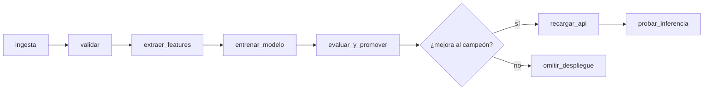

# Pipeline MLOps con Apache Airflow — Dataset Iris

Pipeline de datos y entrenamiento de un modelo
de ML orquestado con Airflow, todo en local sobre Docker.

**Herramientas:** Airflow 3.3 · PyCaret + XGBoost · MLflow (tracking + registry) ·
MinIO (S3 local) · FastAPI (endpoint de inferencia) · PostgreSQL

---

## 1. Qué hace el pipeline



| Tarea | Qué hace | Dónde corre |
|---|---|---|
| `ingesta` | Carga Iris y lo guarda como Parquet en MinIO | Airflow |
| `validar` | Puerta de calidad: nulos, clases, rangos, nº de filas | Airflow |
| `extraer_features` | Añade 5 features derivadas (razones y áreas) | Airflow |
| `entrenar_modelo` | PyCaret + XGBoost, tuning y log a MLflow | **Contenedor aparte** |
| `evaluar_y_promover` | Compara F1 vs. campeón; asigna el alias si gana | Airflow |
| `recargar_api` | La API baja la versión nueva del registry | Airflow → API |
| `probar_inferencia` | Prueba de humo con 3 casos conocidos | Airflow → API |

## 2. Arquitectura

```
                       ┌──────────────┐
                       │  PostgreSQL  │  metadatos de Airflow + backend de MLflow
                       └──────┬───────┘
                              │
  ┌────────────┐       ┌──────┴───────┐       ┌─────────────┐
  │  Airflow   │──────▶│    MLflow    │◀──────│  API (8000) │
  │   (8080)   │       │    (5001)    │       │   FastAPI   │
  └─────┬──────┘       └──────┬───────┘       └─────────────┘
        │                     │
        │ tcp://docker-proxy  │ artefactos
        ▼                     ▼
  ┌────────────┐       ┌──────────────┐
  │ entrenador │──────▶│    MinIO     │  datos + modelos
  │ (efímero)  │       │ (9000/9001)  │
  └────────────┘       └──────────────┘
```

Tres decisiones de diseño que son el núcleo del ejercicio:

**Las dependencias pesadas no van en Airflow.** La imagen de Airflow es la
oficial **sin añadirle nada**: ya trae `pandas`, `numpy`, `boto3`, `pyarrow`,
`scikit-learn`, `requests` y el proveedor de Docker. PyCaret y XGBoost viven en
la imagen `entrenador`, que Airflow arranca como contenedor hermano con
`DockerOperator`. El orquestador habla con MinIO por `boto3` y con MLflow por su
API REST (`src/comun/registro_mlflow.py`) — nunca importa el stack de ML.

Esto no es purismo: instalar el cliente de MLflow en Airflow **rompe Airflow**.
mlflow 2.x exige `cachetools<6` y los constraints de Airflow 3.3 fijan
`cachetools==7.1.4`; pip "resuelve" el conflicto degradando SQLAlchemy de 2.0.51
a 1.4.54, lo que deja inservible Flask-SQLAlchemy → proveedor FAB → servidor web.

**Por XCom viajan rutas, no datos.** XCom se guarda en la base de metadatos de
Airflow; meter DataFrames ahí la infla y la ralentiza. Los datos van a MinIO y
entre tareas solo pasa el URI (`s3://datos/features/...`) y las métricas.

**Airflow no monta el socket de Docker.** Va a través de `docker-socket-proxy`,
que expone la API de Docker por TCP y solo permite los endpoints necesarios. El
motivo es práctico además de higiénico: en macOS el socket aparece dentro del
contenedor como `root:root` modo 755, y conectarse a un socket Unix requiere
permiso de **escritura**. Airflow corre como UID 501, así que le aplican los
permisos de grupo (`r-x`) y falla con `Permission denied`. La alternativa sería
correr Airflow como root; con el proxy no hace falta.

## 3. Requisitos

- Docker Desktop **corriendo** (compruébalo con `docker ps`)
- **8 GB de RAM asignados a Docker**: Docker Desktop → Settings → Resources → Memory.
  Con menos, el scheduler de Airflow muere por OOM y las tareas fallan sin razón aparente.
- ~10 GB de disco libre

## 4. Cómo levantarlo

```bash
cd "[carpeta MLOps git]"
cp .env.example .env          # el .env real no se versiona
chmod +x scripts/levantar.sh
./scripts/levantar.sh
```

(Si te olvidas del `cp`, el script lo hace por ti.)

El script verifica Docker, construye las imágenes en el orden correcto
(`entrenador` primero, porque la API hereda de ella) y espera a que la UI
responda. **La primera construcción tarda 5–12 minutos** por el peso de PyCaret.

Cuando termine:

| Servicio | URL | Credenciales |
|---|---|---|
| Airflow | http://localhost:8080 | `airflow` / `airflow` |
| MLflow | http://localhost:5001 | — |
| MinIO | http://localhost:9001 | `minioadmin` / `minioadmin` |
| API (Swagger) | http://localhost:8000/docs | — |

> El puerto de MLflow en el host es **5001**, no 5000: macOS ocupa el 5000 con
> el receptor de AirPlay.

## 5. Cómo ejecutar el pipeline

Desde la UI de Airflow: busca el DAG `pipeline_iris` y pulsa **Trigger**.

O desde la terminal:

```bash
docker compose exec airflow-scheduler airflow dags trigger pipeline_iris
```

### Qué mirar después

1. **Airflow** → vista *Graph*: las 8 tareas y qué rama tomó el branch.
2. **MLflow** (5001) → experimento `iris_pycaret`: parámetros, métricas y el
   modelo `iris_xgboost` en *Models* con el alias `campeon`.
3. **MinIO** (9001) → bucket `datos` (crudo y features) y bucket `mlflow` (artefactos).
4. **Prueba el endpoint** a mano:

```bash
curl -X POST http://localhost:8000/predict \
  -H 'Content-Type: application/json' \
  -d '{"instancias":[{"largo_sepalo":5.1,"ancho_sepalo":3.5,"largo_petalo":1.4,"ancho_petalo":0.2}]}'
```

```json
{"version_modelo":"1","predicciones":[{"prediccion":"setosa","codigo":0,"confianza":0.9987}]}
```

### Ejecútalo dos veces

La segunda ejecución es la interesante: entra por `evaluar_y_promover`, compara
el F1 nuevo contra el del campeón y, si no mejora, toma la rama
`omitir_despliegue` y **no despliega**. Ese es el patrón campeón/retador, y es
la diferencia entre un pipeline de entrenamiento y un pipeline de MLOps.

## 6. Estructura del proyecto

```
.
├── docker-compose.yaml          # 8 servicios
├── .env                         # credenciales y nombres compartidos
├── dags/
│   └── pipeline_iris.py         # el DAG
├── src/
│   ├── comun/
│   │   ├── features.py          # features compartidas DAG <-> API
│   │   ├── almacen.py           # Parquet en MinIO vía boto3
│   │   └── registro_mlflow.py   # cliente REST mínimo de MLflow
│   ├── entrenador/entrenar.py   # PyCaret + XGBoost (contenedor aparte)
│   └── api/main.py              # FastAPI
├── docker/
│   ├── airflow/Dockerfile       # imagen oficial, SIN añadidos
│   ├── entrenador/Dockerfile    # pesada: pycaret, xgboost
│   ├── mlflow/Dockerfile        # servidor + driver postgres + boto3
│   └── api/Dockerfile           # hereda de entrenador
└── scripts/
    ├── init-postgres.sh         # crea la BD de MLflow
    └── levantar.sh              # arranque en orden
```

`src/comun/features.py` lo importan **tanto el DAG como la API**. Eso evita el
*training/serving skew*: si cada uno calculara las features a su manera, el
modelo recibiría en producción columnas distintas a las del entrenamiento. Es un
bug clásico y silencioso —el modelo no falla, solo acierta menos.

## 7. Problemas frecuentes

**`Cannot connect to the Docker daemon`**
Docker Desktop no está arrancado, o el contexto apunta al socket equivocado:
```bash
docker context use desktop-linux
```

**La tarea `entrenar_modelo` falla con `permission denied` en `/var/run/docker.sock`**
No debería pasar: Airflow no usa el socket, va por `docker-proxy`. Si ocurre,
comprueba que el proxy está arriba y alcanzable desde el scheduler:
```bash
docker compose ps docker-proxy
docker compose exec airflow-scheduler python -c \
  "import requests;print(requests.get('http://docker-proxy:2375/version').json()['Version'])"
```
El que sí necesita el socket es el propio proxy. Si falla ahí, activa en Docker
Desktop → Settings → Advanced la opción *"Allow the default Docker socket to be
used"* y reinicia Docker.

**Tareas que fallan sin mensaje claro / el scheduler se reinicia solo**
Falta memoria. Sube Docker a 8 GB y vuelve a levantar.

**`entrenar_modelo` no encuentra `mlflow` o `minio`**
El contenedor no se unió a la red. Comprueba que existe:
```bash
docker network ls | grep mlops_red
```

**La API responde 503**
Todavía no hay modelo con alias `campeon`. Ejecuta el DAG; si ya lo hiciste:
```bash
curl -X POST http://localhost:8000/recargar
```

**Falla la construcción de PyCaret (arm64 / Apple Silicon)**
Alguna dependencia sin wheel para arm64. Alternativa: entrenar con XGBoost puro
—quita `pycaret` de `docker/entrenador/Dockerfile` y sustituye el bloque de
PyCaret en `entrenar.py` por `XGBClassifier` + `train_test_split`. El resto del
pipeline no cambia.

**Docker Desktop 4.7 (2022)**
Es una versión bastante antigua y algunos de los problemas de arriba desaparecen
al actualizar. Si el arranque da guerra, actualizar Docker Desktop es lo primero
que probaría.

## 8. Empezar de cero

```bash
docker compose down -v          # borra volúmenes: Postgres y MinIO limpios
./scripts/levantar.sh
```

## 9. Ideas para extender

- **Assets de Airflow** (`schedule=[Asset(...)]`) para que el reentrenamiento se
  dispare cuando llegan datos nuevos, en vez de a mano.
- **Dynamic task mapping** para probar varios estimadores en paralelo
  (`create_model` sobre xgboost, lightgbm, rf) y quedarte con el mejor.
- **Detección de drift** con Evidently en un DAG programado que dispare el
  reentrenamiento al cruzar un umbral.
- **Migrar a SageMaker**: lo que cambia es la tarea de entrenamiento
  (`SageMakerTrainingOperator` en lugar de `DockerOperator`) y el registry.
  La forma del DAG se mantiene igual.
